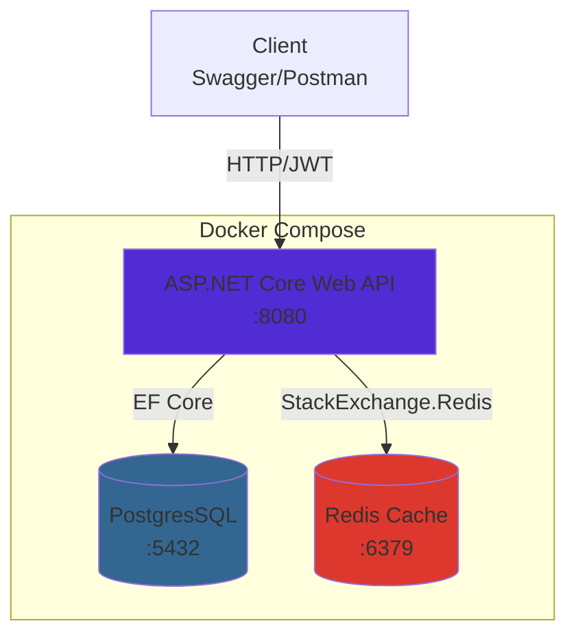

| [🇬🇧 English](README.md) | [🇷🇺 Русский](README.ru.md) |

# NotesApi (education project)
> Clean Architecture REST API with production-grade features: validation, error handling, JWT auth, distributed cache, health checks

## 🚀 Quick Start

```bash
# Clone and run
git clone https://github.com/er4se/NotesApi
cd NotesApi
docker-compose up -d

# Check health
curl http://localhost:5000/health

# Open Swagger
open http://localhost:5000/swagger
```

**First API call:**
```bash
# Register
curl -X POST http://localhost:5000/api/auth/register \
  -H "Content-Type: application/json" \
  -d '{"email":"test@example.com", "password":"Test1234~"}'

# Login
curl -X POST http://localhost:5000/api/auth/login \
  -H "Content-Type: application/json" \
  -d '{"email":"test@example.com", "password":"Test1234~"}'
```

## 📖 About

NotesApi is a educational backend-service on ASP.NET Core that demonstrates production approaches to building Web-APIs: validation, centralized error handling, authenticationvia JWT, distributed caching, health-checks, and containerization

## ✨ Features

- Input data validation via **FluentValidation**;
- Global error handling with **Problem Details (RFC 7807)**;
- Structured logging via **Serilog + CorrelationId**;
- Authentication and authorization via **JWT Bearer**;
- Distributed cache via **Redis**;
- **Health-checks** for API, Postgres, Redis;
- Running via **Docker Compose**

## 🏗️ Architecture

### Architecture:



### Application layers:


## 📡 API Endpoints

| Method | Endpoint | Auth | Description |
|--------|----------|------|-------------|
| POST | `/api/auth/register` | ❌ | Register new user |
| POST | `/api/auth/login` | ❌ | Login and get JWT |
| GET | `/api/notes` | ✅ | Get all notes (cached) |
| GET | `/api/notes/{id}` | ✅ | Get note by ID (cached) |
| POST | `/api/notes` | ✅ | Create new note |
| PUT | `/api/notes/{id}` | ✅ | Update note |
| DELETE | `/api/notes/{id}` | ✅ | Delete note |
| GET | `/health` | ❌ | Health check endpoint |

**Authentication:** Bearer JWT token in `Authorization` header

## ⚡ Performance

**Redis Cache Impact** (20 requests):

| Scenario | Average Time | Improvement |
|----------|--------------|-------------|
| Without cache | 22ms | baseline |
| With cache (hit) | 4ms | **5.5x faster** ⚡ |

Cache TTL: 60 seconds  
Tested on: Docker Compose, local environment

## 🔧 Configuration

### Development (appsettings.json)
```json
{
  "Jwt": {
    "Key": "your-secret-key-here",
    "Issuer": "NotesApi",
    "Audience": "NotesApiClient"
  }
}
```

### Production (Environment Variables)
```bash
# Docker Compose
environment:
  - Jwt__Key=${JWT_SECRET_KEY}
  - ConnectionStrings__DefaultConnection=${DB_CONNECTION}
  - ConnectionStrings__Redis=${REDIS_CONNECTION}
```

### Using .NET User Secrets (recommended for local dev)
```bash
dotnet user-secrets init --project NotesApi.Web
dotnet user-secrets set "Jwt:Key" "your-secret-key"
```

⚠️ **Never commit production secrets to Git!**

## 🧪 Testing

### 1. Register and Login
```bash
# Register
REGISTER_RESPONSE=$(curl -s -X POST http://localhost:5000/api/auth/register \
  -H "Content-Type: application/json" \
  -d '{"email":"test@test.com","password":"Test1234"}')

# Login
TOKEN=$(curl -s -X POST http://localhost:5000/api/auth/login \
  -H "Content-Type: application/json" \
  -d '{"email":"test@test.com","password":"Test1234"}' | jq -r '.token')

echo "Token: $TOKEN"
```

### 2. Create Note (with JWT)
```bash
curl -X POST http://localhost:5000/api/notes \
  -H "Authorization: Bearer $TOKEN" \
  -H "Content-Type: application/json" \
  -d '{"title":"My Note","content":"Note content"}'
```

### 3. Verify Cache (check logs)
```bash
# First request (cache miss)
curl -H "Authorization: Bearer $TOKEN" http://localhost:5000/api/notes

# Second request (cache hit - should be faster)
curl -H "Authorization: Bearer $TOKEN" http://localhost:5000/api/notes

# Check logs
docker logs notes_api | grep "Cache hit"
```

### 4. Health Check
```bash
curl http://localhost:5000/health | jq

# Stop Redis and check again
docker stop notes_redis
curl http://localhost:5000/health | jq  # Should show redis unhealthy
```

## 🗺️ Roadmap

### ✅ Phase 1: Production-Ready Monolith (Completed)
- Clean Architecture
- JWT Authentication
- Redis Caching
- Health Checks
- Docker Compose

### 🚧 Phase 2: Event-Driven Architecture (In Progress)
- [ ] RabbitMQ integration
- [ ] Async communication patterns
- [ ] Event sourcing basics
- [ ] CQRS refinement

### 📋 Phase 3: Microservices & Observability (Planned)
- [ ] Split into microservices
- [ ] API Gateway (Ocelot/YARP)
- [ ] gRPC communication
- [ ] OpenTelemetry tracing
- [ ] Prometheus metrics
- [ ] Unit & Integration tests

### 🔮 Phase 4: Cloud & Orchestration (Future)
- [ ] Kubernetes deployment
- [ ] CI/CD pipeline
- [ ] Azure/AWS infrastructure

## 📄 License

This project is released into the public domain under [The Unlicense](https://unlicense.org/)


Maschenko Alexander, 2026
