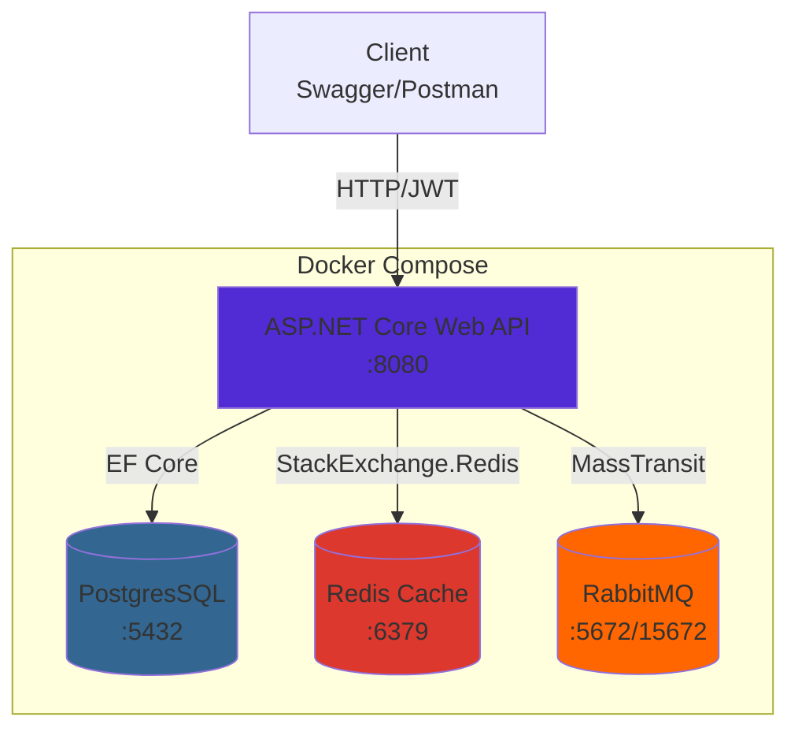
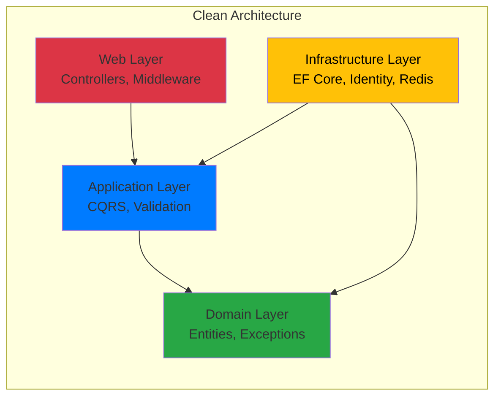

# NotesApi (учебный проект)

[](README.md)
[](README.ru.md)


> REST API с чистой архитектурой и функциями production-уровня: валидация данных, обработка ошибок, JWT-аутентификация, распределенный кэш, health-checks

## 🚀 Быстрый запуск

```bash
# Клонирование и запуск
git clone https://github.com/er4se/NotesApi
cd NotesApi
docker-compose up -d

# Проверка health
curl http://localhost:5000/health

# Открыть Swagger
open http://localhost:5000/swagger
```

**Первый вызов API:**
```bash
# Регистрация
curl -X POST http://localhost:5000/api/auth/register \
  -H "Content-Type: application/json" \
  -d '{"email":"test@example.com", "password":"Test1234~"}'

# Авторизация
curl -X POST http://localhost:5000/api/auth/login \
  -H "Content-Type: application/json" \
  -d '{"email":"test@example.com", "password":"Test1234~"}'
```

## 📖 О чем проект

NotesApi - учебный backend-сервис на ASP.NET Core, демонстрирующий production-подходы к построению web-API: валидация, централизованная обработка ошибок, аутентификация через JWT, распределённый кеш, health checks и контейнеризация

## ✨ Реализованные возможности

- Валидация входящих данных через **FluentValidation**;
- Глобальная обработка ошибок с **Problem Details (RFC 7807)**;
- Структурированное логирование через **Serilog + CorrelationId**;
- Аутентификация и авторизация через **JWT Bearer**;
- Distributed cache через **Redis**;
- **Event-driven** интегрирована через **RabbitMQ + MassTransit**;
- **Health-checks** для API, Postgres, Redis;
- Запуск через **Docker Compose**

## 🏗️ Архитектура

### Архитектура:



### Слои приложения:



## 📡 API Endpoints

| Метод | Эндпоинты | Аутентификация | Описание |
|-------|-----------|----------------|----------|
| POST | `/api/auth/register` | ❌ | Регистрация нового пользователя |
| POST | `/api/auth/login` | ❌ | Авторизация и получение JWT |
| GET | `/api/notes` | ✅ | Получение всех заметок (кэшировано) |
| GET | `/api/notes/{id}` | ✅ | Получение заметки по ID (кэшировано) |
| POST | `/api/notes` | ✅ | Создание новой заметки |
| PUT | `/api/notes/{id}` | ✅ | Обновление заметки |
| DELETE | `/api/notes/{id}` | ✅ | Удаление заметки |
| GET | `/health` | ❌ | Health check эндпоинт |

**Аутентификация:** Bearer JWT token в заголовке `Authorization`

## 📡 Event-Driven Messaging (Фаза 2)

NotesApi публикует бизнес-события в RabbitMQ при изменении заметок и обрабатывает их асинхронно через MassTransit

### Поток событий

Создание заметки:

1. Клиент отправляет `POST /api/notes` (опционально с заголовком `X-Correlation-ID`).
2. API:
   - валидирует запрос;
   - сохраняет заметку в PostgreSQL;
   - публикует событие `NoteCreated` в RabbitMQ через MassTransit.
3. Фоновый consumer `NoteCreatedConsumer` получает событие из очереди и логирует факт обработки.
4. Все шаги трассируются по одному `CorrelationId`.

### Инфраструктура

- **RabbitMQ**:
  - поднимается в `docker-compose` как сервис `rabbitmq`;
  - UI: `http://localhost:15672` (login: `guest`, password: `guest`);
  - используется virtual host `/`.

- **MassTransit**:
  - интегрирован в `NotesApi.Web`;
  - использует RabbitMQ как transport;
  - автоматически создаёт exchanges/queues для consumers через `ConfigureEndpoints`.

### События

Контракты событий находятся в проекте `NotesApi.Contracts` (namespace `NotesApi.Contracts.Events.V1`).

| Event         | Trigger                        | Important fields                                      |
|---------------|--------------------------------|-------------------------------------------------------|
| `NoteCreated` | After successful note creation | `CorrelationId`, `NoteId`, `Title`, `CreatedAt`, `UserId` |
| `NoteUpdated` | After successful note update   | `CorrelationId`, `NoteId`, `Title`, `UpdatedAt`, `UserId` |
| `NoteDeleted` | After successful note delete   | `CorrelationId`, `NoteId`, `DeletedAt`, `UserId`      |

## 🧭 Наблюдаемость

Для каждой операции используется `CorrelationId`, который:

- приходит от клиента в `X-Correlation-ID` либо генерируется middleware;
- пишется в `Serilog` через `LogContext.PushProperty("CorrelationId", ...)`;
- сохраняется в событии (`NoteCreated.CorrelationId`);
- логируется в consumer’е.

## ⚡ Производительность

**Влияние кэширования через Redis** (20 запросов):

| Сценарий | Среднее время | Улучшение |
|----------|---------------|-----------|
| Без кэширования | 22ms | базовый |
| С кэшированием (hit) | 4ms | **5.5x быстрее** ⚡ |

TTL кэша: 60 секунд  
Протестировано в: Docker Compose, локальная среда

## 🔧 Конфигурация

### Development (appsettings.json)
```json
{
  "Jwt": {
    "Key": "your-secret-key-here",
    "Issuer": "NotesApi",
    "Audience": "NotesApiClient"
  }
}
```

### Production (переменные окружения)
```bash
# Docker Compose
environment:
  - Jwt__Key=${JWT_SECRET_KEY}
  - ConnectionStrings__DefaultConnection=${DB_CONNECTION}
  - ConnectionStrings__Redis=${REDIS_CONNECTION}
```

### Использование .NET User Secrets (рекомендовано для локальной разработки)
```bash
dotnet user-secrets init --project NotesApi.Web
dotnet user-secrets set "Jwt:Key" "your-secret-key"
```

⚠️ **Никогда не публикуйте рабочую секретную информацию в Git!**

## 🧪 Тестирование

### 1. Регистрация и авторизация
```bash
# Регистрация
REGISTER_RESPONSE=$(curl -s -X POST http://localhost:5000/api/auth/register \
  -H "Content-Type: application/json" \
  -d '{"email":"test@test.com","password":"Test1234"}')

# Авторизация
TOKEN=$(curl -s -X POST http://localhost:5000/api/auth/login \
  -H "Content-Type: application/json" \
  -d '{"email":"test@test.com","password":"Test1234"}' | jq -r '.token')

echo "Token: $TOKEN"
```

### 2. Создание заметки (с помощью JWT)
```bash
curl -X POST http://localhost:5000/api/notes \
  -H "Authorization: Bearer $TOKEN" \
  -H "Content-Type: application/json" \
  -d '{"title":"My Note","content":"Note content"}'
```

### 3. Проверка кэша (проверка логов)
```bash
# Первый запрос (cache miss)
curl -H "Authorization: Bearer $TOKEN" http://localhost:5000/api/notes

# Второй запрос (cache hit - должен быть быстрее)
curl -H "Authorization: Bearer $TOKEN" http://localhost:5000/api/notes

# Проверка логов
docker logs notes_api | grep "Cache hit"
```

### 4. Health Check
```bash
curl http://localhost:5000/health | jq

# Остановить Redis и проверить снова
docker stop notes_redis
curl http://localhost:5000/health | jq  # Redis должен быть указан как unhealthy
```

## 🗺️ Roadmap

### ✅ Фаза 1: Production-Ready Монолит (Завершено)
- Clean Architecture
- JWT аутентификация
- Redis кэширование
- Health Checks
- Docker Compose

### 🚧 Фаза 2: Event-Driven Архитектура (В процессе)
- [ ] RabbitMQ интеграция
- [ ] Паттерны асинхронности
- [ ] Event sourcing основы
- [ ] CQRS улучшения

### 📋 Фаза 3: Микросервисность и Наблюдаемость (Запланированно)
- [ ] Деление на микросервисы
- [ ] API Gateway (Ocelot/YARP)
- [ ] gRPC коммуникация
- [ ] OpenTelemetry отслеживание
- [ ] Prometheus метрики
- [ ] Unit & Интеграционные тесты

### 🔮 Фаза 4: Облачные технологии и Оркестрация (Запланированно)
- [ ] Kubernetes развертка
- [ ] CI/CD pipeline
- [ ] Azure/AWS инфраструктура

## 📄 Лицензия

Этот проект опубликован публично согласно [The Unlicense](https://unlicense.org/)


Мащенко Александр, 2026
